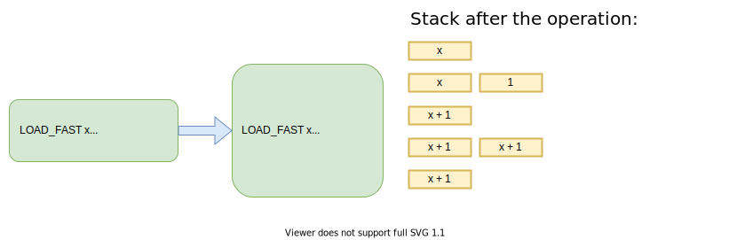
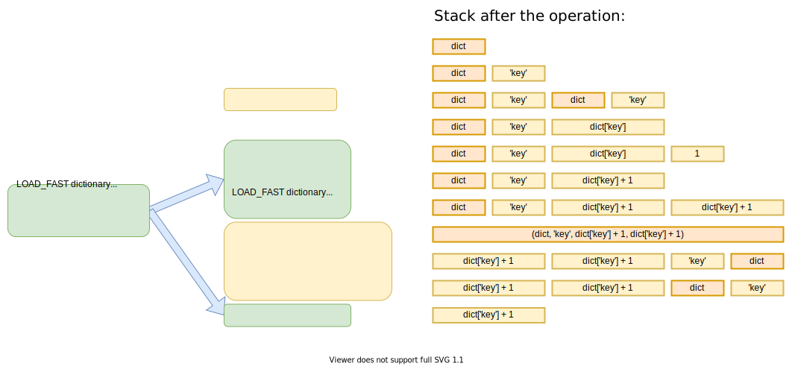

plusplus
========

[](https://pypi.org/project/plusplus/)
[](https://github.com/borzunov/plusplus/actions)


Enables increment operators in Python with a bytecode hack

What's this?
------------

By default, Python supports neither pre-increments (like `++x`) nor post-increments (like `x++`).
However, the first ones are _syntactically correct_ since Python parses them as two subsequent `+x` operations,
where `+` is the [unary plus operator](https://docs.python.org/3/reference/datamodel.html#object.__pos__)
(same with `--x` and the [unary minus](https://docs.python.org/3/reference/datamodel.html#object.__neg__)).
They both have no effect, since in practice `-(-x) == +(+x) == x`.

This module turns the `++x`-like expressions into `x += 1` at the bytecode level.
Increments and decrements of collection items and object attributes are supported as well, for example:

```python
some_dict = {'key': 42}
++some_dict['key']
assert some_dict['key'] == 43
```

Unlike the `x += 1` statement, `++x` remains to be an _expression_, so it works fine inside other expressions,
`if`/`while` conditions, lambda functions, and list/dict comprehensions:

```python
array[++index] = new_value

if --connection.num_users == 0:
    connection.close()

button.add_click_callback(lambda: ++counter)

index = 0
indexed_cells = {++index: cell for row in table for cell in row}
```

See [tests](tests/test_plusplus.py) for more sophisticated examples.

[[How it works](#how-it-works)] [[Installation](#how-to-use-it)]

Why?
----

I don't claim that allowing increments is good for real projects: such code may become less readable,
confuse new developers, and behave differently if copied to environments without this module.
I've made this module for fun, as a demonstration of Python flexibility and bytecode manipulation techniques.

However, some situations where increments simplify code do exist
(see [examples](docs/stdlib_examples.md) from the Python's standard library).
Also, having the increment expressions seems consistent with
[PEP 572 "Assignment Expressions"](https://www.python.org/dev/peps/pep-0572/)
that introduced the `x := value` expressions in Python 3.8+.

How it works?
-------------

### Patching bytecode

Python compiles all source code to a low-level [bytecode](https://docs.python.org/3.7/library/dis.html)
executed on the Python's stack-based virtual machine. Each bytecode instruction consumes a few items from the stack,
does something with them, and pushes the results back to the stack.

The `++x` expressions are compiled into two consecutive
[`UNARY_POSITIVE`](https://docs.python.org/3.7/library/dis.html#opcode-UNARY_POSITIVE) instructions
that do not save the intermediate result in between (same with `--x` and two
[`UNARY_NEGATIVE`](https://docs.python.org/3.7/library/dis.html#opcode-UNARY_NEGATIVE) instructions).
No other expressions produce a similar bytecode pattern.

`plusplus` replaces these patterns with the bytecode for `x += 1`, then adds the bytecode for storing
the resulting value to the place where the initial value was taken.

This is what happens for the `y = ++x` line:



A similar but more complex transformation happens for the code with subscription expressions
like `value = ++dictionary['key']`. We need the instructions from the yellow boxes to save the initial location and
recall it when the increment is done (see the explanation below):



This bytecode is similar to what the string `dictionary['key'] += 1` compiles to. The only difference is that it
keeps an extra copy of the incremented value,
so we can return it from the expression and assign it to the `value` variable.

Arguably, the least clear part here is the second yellow box. Actually, it is only needed to reorder
the top 4 items of the stack. If we need to reorder the top 2 or 3 items of the stack, we can just use
the [`ROT_TWO`](https://docs.python.org/3.7/library/dis.html#opcode-ROT_TWO) and
[`ROT_THREE`](https://docs.python.org/3.7/library/dis.html#opcode-ROT_THREE) instructions (they do a circular shift
of the specified number of items of the stack). If we had a `ROT_FOUR` instruction, we would be able to just
replace the second yellow box with two `ROT_FOUR`s to achieve the desired order.

However, `ROT_FOUR` was removed in Python 3.2
(since it was [rarely used](https://bugs.python.org/issue929502) by the compiler) and
recovered back only in Python 3.8. If we want to support Python 3.3 - 3.7, we need to use a workaround,
e.g. the [`BUILD_TUPLE`](https://docs.python.org/3.7/library/dis.html#opcode-BUILD_TUPLE) and
[`UNPACK_SEQUENCE`](https://docs.python.org/3.7/library/dis.html#opcode-UNPACK_SEQUENCE) instructions.
The first one replaces the top N items of the stack with a tuple made of these N items. The second unpacks the tuple
putting the values on the stack right-to-left, i.e. _in reverse order_. We use them to reverse the top 4 items,
then swap the top two to achieve the desired order.

[[Source code](src/plusplus/patching.py)]

### The @enable_increments decorator

The first way to enable the increments is to use a decorator that would patch the bytecode of a given function.

The decorator disassembles the bytecode, patches the patterns described above, and recursively calls itself
for any nested bytecode objects (this way, the nested function and class definitions are also patched).

The bytecode is disassembled and assembled back
using the [MatthieuDartiailh/bytecode](https://github.com/MatthieuDartiailh/bytecode) library.

[[Source code](src/plusplus/wrappers.py#L11)]

### Enabling increments in the whole package

The Python import system allows loading modules not only from files but from any reasonable place
(e.g. there was a [module](https://github.com/drathier/stack-overflow-import) that enables importing code
from Stack Overflow answers). The only thing you need is to provide module contents, including its bytecode.

We can leverage this to implement a wrapping loader that imports the module as usual but patching its bytecode
as described above. To do this, we can create a new
[MetaPathFinder](https://docs.python.org/3/library/importlib.html#importlib.abc.MetaPathFinder) and install it
to [sys.meta_path](https://docs.python.org/3/library/sys.html#sys.meta_path).

[[Source code](src/plusplus/wrappers.py#L27)]

### Why not just override unary plus operator?

- This way, it would be impossible to distinguish applying two unary operators consequently (like `++x`) from
    applying them in separate places of a program (like in the snippet below).
    It is important to not change behavior in the latter case.

    ```python
    x = -value
    y = -x
    ```

- Overriding operators via magic methods
    (such as [`__pos__()`](https://docs.python.org/3/reference/datamodel.html#object.__pos__) and
    [`__neg__()`](https://docs.python.org/3/reference/datamodel.html#object.__neg__))
    do not work for built-in Python types like `int`, `float`, etc.
    In contrast, `plusplus` works with all built-in and user-defined types.

### Caveats

- `pytest` does its own bytecode modifications in tests, adding the code to save intermediate expression results
    to the `assert` statements. This is necessary to show these results if the test fails
    (see [pytest docs](https://docs.pytest.org/en/stable/assert.html#assertion-introspection-details)).

    By default, this breaks the `plusplus` patcher because the two `UNARY_POSITIVE` instructions become
    separated by the code saving the result of the first `UNARY_POSITIVE`.

    We fix that by removing the code saving some of the intermediate results, which does not break
    the pytest introspection.

    [[Source code](src/plusplus/patching.py#L87)]

How to use it?
--------------

You can install this module with pip:

```
pip install plusplus
```

### For a particular function or method

Add a decorator:

```python
from plusplus import enable_increments

@enable_increments
def increment_and_return(x):
    return ++x
```

This enables increments for all code inside the function, including nested function and class definitions.

### For all code in your package

In `package/__init__.py`, make this call __before__ you import submodules:

```python
from plusplus import enable_increments

enable_increments(__name__)

# Import submodules here
...
```

This enables increments in the submodules, but not in the `package/__init__.py` code itself.

Other ideas
-----------

The same approach could be used to implement
the [assignment expressions](https://docs.python.org/3/whatsnew/3.8.html#assignment-expressions)
for the Python versions that don't support them.
For example, we could replace the `x <-- value` expressions (two unary minuses + one comparison)
with actual assignments (setting `x` to `value`).

See also
--------

- [cpmoptimize](https://github.com/borzunov/cpmoptimize) &mdash; a module that optimizes a Python code
    calculating linear recurrences, reducing the time complexity from O(n) to O(log n).
- [dontasq](https://github.com/borzunov/dontasq) &mdash; a module that adds functional-style methods
    (such as `.where()`, `.group_by()`, `.order_by()`) to built-in Python collections.

Authors
-------

Copyright &copy; 2021 [Alexander Borzunov](https://github.com/borzunov)
